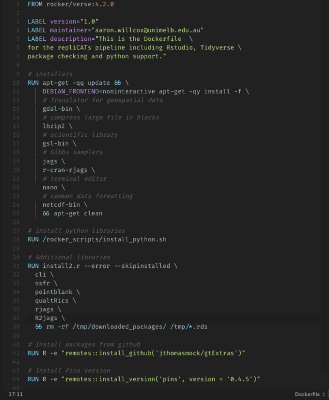

## Research Data & Code 

> - Source code generated each year grows by about 20% (L. Hatton & M. van Genuchten, 2019).

> - 93% of authors fail to respond or declined sharing data.
> - PLOS journals data sharing <30%
> - Sharing policy increase: 15% in 2015 to 75% in 2020 (Culina et al., 2018).

> - Data handling and processing often informally transmitted (Maer-Matei et al., 2019).
> - Lack of formal training for researchers (Koehler Leman et al., 2020).

**Source code** generated for research continues to grow each year by about 20% suggesting computational practices are an essential requirement to research. However, obtaining data and code is still alarming low! 

Complience rates through Open Access Journals are terrible; given Authors Data Availability Statements (DAS) **93% of authors fail to respond** or declined sharing data. Data sharing in PLOS journals is also less than 30%. 
**Code-sharing policies** are increasingly being adopted by journals, rising from 15% of ecology journals in 2015 to 75% in 2020. They are generally accompanied by guidelines, checklists and workflows that requires access to software artifacts, computational environment and workflow documentation. 

All require additional training, skills and knowledge on the part of the researcher to understand. Without **formal training** in code and workflow building, code development is typically an **ad-hoc process** that occurs over the course of a project's life, with little forethought given to structuring a workflow for ensuring data preservation and reproducibility. So...

## Computational Reproducibility

> The ability to produce equivalent analytical outcomes from the same data set using the same **code** and **software** as the original study  (Fidler et al., 2017).

> - Why is there this gap between creation and sharing of knowledge?

If Computational Reproducibility refers to the ability to produce equivalent analytical outcomes from the same data set, using the same code and software as the original study (Fidler et al., 2017) 
then **why** is there this gap between creation and sharing of knowledge? 

##  Lets Begin! {data-background="figures/begin.gif"} 

Lets begin!

## Sources of irreproducibility

> - Workflows
> - Environment(Software dependencies)
> - Version Control System 
> - Documentation (Leipzig et al., 2020)

Common sources of irreproducibility are the lack of a **workflow framework**, including missing **software dependencies**, lack of a **version control system**, **documentation** (Leipzig et al., 2020).

## What If I Told You... {data-background="figures/morph.jpg"} 

**What if I told you** that these are not separate components?
What if I told you that researchers are using these **practices and, differ** very little to that of software engineering?

## Practices differ very little to software engineers {data-background="figures/morph.jpg"} 

What if I told you that researchers are using these **practices and, differ** very little to that of software engineering?

## DevOps 

> -  Culture or working philosophy that fosters cross-functional team communication and collaboration.
> - Orients the **way** in which a team collaborates.
> - DevOps Centers on a culture of collaboration.
> - ResOps should* center on a culture of reproducibility.

Irreproducibility and a lack of transparency can be overcome by borrowing a set of tools and practices from software engineering, called **DevOps**. DevOps is a **culture** or working philosophy that fosters cross-functional team communication and collaboration and, one of the primary benefits is that it does not require technical changes however, it **orients** the **way** in which a team collaborates and works.

It **centers** on changing the culture through team dynamics to address the tasks between development and operation such as testing and continuous practices. 

Similar to the way DevOps is a culture in that it orients that way a team **collaborates** together, ResOps is a culture of **reproducibility** with best practices already used or gaining popularity in the scientific community. 

## The Modern Scientist Role

> - Developers
> - Testers
> - Programmers
> - Operators
> - **One Role**

The key difference is our roles as researchers are: **developers**, **testing**, **programmers** and **operators** is that, they are condensed into **one role**

## We Create Software {data-background="figures/kreese.gif"} 

**We are creating software**. Software as a goal should be an individual responsibility based on community convergence of best practices. Researchers should view code and software as a first class product and it should be treated in the same respect as a journal article. However attitudes differ between creating and sharing. Efforts to advance data as a first class research product **can** be measured through a the set of FAIR principles

## F.A.I.R Principles 

> - Findable 
> - Accessible
> - Interoperable
> - Reusable 
> - **Not a technical solution or standard**

However, FAIR principles are **not a technical solution** or standard and, there is some ambiguity on exactly what tools to implement and how to bring them all together into a workflow. Choices of FAIR implementation vary for different communities which are driven by communities of practice. They are *general enough* that they can be mapped to research software though. The convergence of best practices in the scientific community offer some direction into the technical tools and processes. 
Sources of irreproducibility provide some insights into technical solutions of such practices in the form of increased documentation, version control and environment. They also highlight key areas of skills training needed for modern research. Each of these as a component of DevOps can and has been implemented into scientific workflows.

## Version Control 

> - Analysis_Report_2022_v001_final_FINAL_Submitted.pdf

A version control system is a way to synchronize and track changes in a project file. This includes what and by whom was changed and then, these are sent to a server so other contributors and collaborators can manage the same files. This essentially is the modern day version of avoiding this: 

## Version Control 

> - Git command line and communication protocol
> - Github Web platform 
> - Re-purposed for research

**Git** is the command line and communication protocol to enable the use of a version control system. **Github** is a web based platform that makes it easier to collaborate with git in that it can hold projects in multiple repositories and has additional project managing tools such as issue tracking and tools and, manage roles and comments. What this means for research is that by **repurposing VCS** for science we have the ability to provide a snapshot of contextual changes to files and have a rich data provenance for our scientific workflows. All the information about the origin, context, derivation, roles and history of some digital artefact is now recorded provenance.

## Continuous Practices

> - **Continuous Integration**: Integrate code, automate, test 
> - **Continuous Delivery**: testing, dynamic documents
> - **Continuous Deployment**: packaging and releases

Continuous practices are dependent on the application. By definition **continuous integration** is the practice of integrating code changes constantly into the main branch and automate builds and testing. **Continuous delivery** should be adopted by dynamic documents and delivered to key stakeholders. **Continuous deployment** is more concerned with packaging an entire repo and deploying updated applications Continuous Practices. 

## Inrease Your Documentation Game 

> - Document text code and data
> - ReadME and Wikis
> - Annotating Code
> - YAMLs 
> - Vignettes 

We need to Increase our **Documentation** Game
The more documentation that is included the higher the degree of transparency and easier it its for researchers to understand and reproduce results (Gundersen, 2021). By adding **VCS**, dockerfiles and annotating code etc we are inheratnly increasing our documentation game. 

## Container Technology (Docker)

> - Lock and isolate the environment
> - Manage Dependencies 
> - Isolate Analysis from Local
> - Reusable and Portable 

One of the key issues around computational reproducibility is being able to run the results on the same software and obtaining the same results in order to verify the findings. The key obstacle is the **software environment** **and**/or documented instructions for creating the environment to make it work

Ensuring scientific workflows can be reproduced through containerization like Docker allows us to record the version of its components and lock the environment into place such that when an workflow is run, we are providing the user with the same software dependencies. In essence we **1)** manage software dependencies; **2)** isolate analyses from the idiosyncrasies of local environment and **3)** virtualize entire analyses for portability and preservation

## Dockerfile Example 

</img>

The **Dockerfile** contains the instructions for creating a system environemnt and has additional benefits for research in that it provides documentation in the form of metadata. Docker is essentailly a text file outlining the base system libraries and dependencies. Like this example from the repliCATs project. 

## New Paradigm 

> - **Scientific Workflows**
> - Version Control **<||>** Documented History 
> - Docker **<||>**| System Environment & Dependencies 
> - CI/CD **<||>** Testing, delivery, Rapid feedback
> - "*Power in incorporating them into a scientific workflow greatly increases the ability for its reusability*"

**Scientific workflows** should implement **VCS X3**, container technology, automate and increase their documentation game  (Xubo, n.d.). There should be a clear distinction between data, methods and outputs while capturing the relationship between them, including, specifying the computational environment that was used during the analysis.

The components alone will address in part, issues of irreproducibility but the **power** in incorporating them into a scientific workflow greatly increases the ability for its reusability. 

## ResOps

> |  ResOps is an attempt to distinguish scientific software from DevOps. Emphasising communities of practice that, enable the convergence of tools implemented in the scientific community, to enable computational reproducibility in the form of a scientific workflow. 

So to define ResOps: **BLOCK QUOTE**

## Inundated with Choice? 

> - Look to the scientific community. 
> - Not a technical problem but a educational problem.

Inundated with choice? 
**Look to the scientific community.** 
This might look like a **technical** problem but we argue its a educational problem. Community forms a convergence on best practices which we tend to adopt, learn and implement. Knowledge of these tools is now more important than ever and should form the basis for early skill and training development. 

## Publish your code! It is good enough!

> | Wants to share a trade secret with scientists: Most professional computer software isnt very good. That the code is a little raw is one of the main reasons scientists give for not sharing it with others. So if your code is good enough to do the job then it is good enough to release (Barnes, 2010).

Publish your code it is good enough
To finish with a quote from Barnes, 2010, a professional software engineer: 
"Wants to share a trade secret with scientists: Most professional computer software isnt very good. That the code is a little raw is one of the main reasons scientists give for not sharing it with others. So if your code is good enough to do the job then, it is good enough to release."

## Send It To The Internet  {data-background="figures/hasbrown.jpg"} 

Hashbrown Resops 

Thank you for your time (hope you enjoyed the Cobra Kai memes), paper on this will be up on preprint soon. 

## Thank You! 

<em><a href="https://twitter.com/aaron_willcox">@aaron_willcox</a></em>

## {data-background-iframe="ref.html"}
